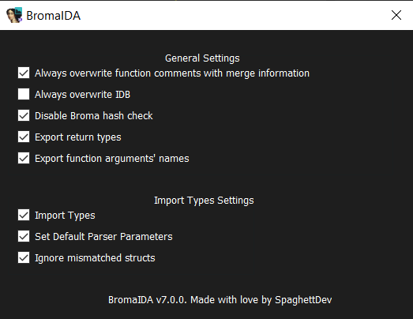

# BromaIDA

IDA Broma support (now real).

Parses a Broma file and exports the bindings into a Broma file/imports the bindings into the current IDA project.

## Requirements

- IDA 7.0 or higher
- IDAPython
- Python v3.10.0+ (tested with v3.11.9)
- PyBroma
- If you want to be able to import types:
  - IDAClang

## Features

- Importing
  - Import function names
  - Import types (see [Importing Types Requirements](#importing-types-requirements)). If enabled, will do the following:
    - Import Broma classes members, virtual functions, etc...
    - Import function return types
    - Import function arguments types and names
    - On Android binaries, fixes IDA completely messing up the arguments of functions for no reason
- Exporting
  - Export function addresses for any platform
  - Export function return types (if enabled, see [BromaIDA Settings](#bromaida-settings))
  - Export function arguments' names (if enabled, see [BromaIDA Settings](#bromaida-settings))

## Installation

1. Get python, then `pip install https://github.com/Prevter/PyBroma/archive/refs/heads/main.zip`
2. Download the release/zip file
3. Copy `BromaIDA.py` and the `broma_ida` folder into `IDA_DIRECTORY/plugins`

## Usage

1. `Ctrl-Shift-B`, or from the Top Bar (Edit -> Plugins -> BromaIDA) to start importing/exporting
2. Browse and select the Broma file
3. Let the script handle the rest and enjoy free/exported bindings

## Importing Types Requirements

- To import types:
  - You must have IDAClang.
  - `Extras.bro` **_must_** be in the same directory as the imported Broma file

You no longer need the STL headers for the given binary, as BromaIDA packages them for Android (android32, android64), Mach-O (imac, m1, ios) and Windows.

## BromaIDA Settings

Can be accessed through the main popup by clicking on the "Settings" button.
This replaces the old "ask everything everytime" method.

Here you will find some options you can set, such as importing types, settings default parser parameters, etc...
The options you chose will be saved into a [shelf](https://docs.python.org/3/library/shelve.html) stored in the `$HOME/broma_ida` folder.

## Utilities

This section is meant for people who want to contribute.

In the `utils` folder, you can find some utilities that can help in contributing.

- Currently has:
  - `tasks.json`: To be put in `/BromaIDA/.vscode`, adds 2 tasks for VSCode. "Install Plugin" will copy `BromaIDA.py` and the `broma_ida` to the `IDA_DIRECTORY/plugins` directory; And "Launch IDA v8.3" which will launch IDA (shocker). Just be sure to replace IDA's directory with your IDA installation directory.

## Thanks

- Special thanks to:
  - The [IDAPython API](https://hex-rays.com/products/ida/support/idapython_docs): Used for everything.
  - [CallocGD](https://github.com/CallocGD)'s [PyBroma](https://github.com/CallocGD/PyBroma): Used to parse imported Broma files.
  - [Prevter](https://github.com/Prevter): Updating PyBroma
  - @sleepyut: Issuing 3 trillion bug reports. Also for suggesting a bunch of features. (they also made BromaBJ)
  - [AngelDev06](https://github.com/AngelDev06): Contributing features.
