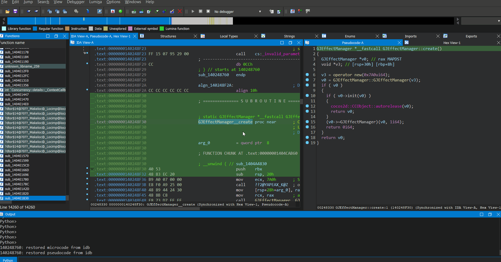

# BromaIDA

IDA Broma support (now real).

Parses a Broma file and exports the bindings into a Broma file/imports the bindings into the current IDA project.

## Requirements

- IDA 7.0 or higher
- IDAPython
- Python v3.0.0+ (tested with v3.11.9)
- PyBroma
- If you want to be able to import types:
  - IDAClang
  - MSVC STL headers if reversing Windows binary, GCC STL headers for the other platforms

## Features

- Import method names, return type and arguments
- Export method addresses
- Import types (see [Importing Types Requirements](#importing-types-requirements))
- On Android binaries, fixes IDA completely messing up the arguments of functions for no reason

## Installation

1. Get python, then `git clone https://github.com/CallocGD/PyBroma --recursive`, `cd PyBroma` then finally `python .\setup.py install` to install PyBroma (blame CallocGD for breaking `pip install https://github.com/CallocGD/PyBroma/archive/refs/heads/main.zip`)
1. Download the release/zip file
2. Copy `BromaIDA.py` and the `broma_ida` folder into `IDA_DIRECTORY/plugins`

## Usage

1. `Ctrl-Shift-B` to start importing/exporting
2. Browse and select the broma file (must have Extras.bro in the same directory if you want to import types)
3. Let the script handle the rest and enjoy free/exported bindings

## Importing Types Requirements

To import types, you must have IDAClang and the headers for the target platform. Currently only tested with Windows and Android.
1. Open the target binary in IDA
2. In the top bar, select Options > Compiler, Source Parser: Clang. And in Include Directories, replace with the location of the header files
    1. For Windows binary
        1. Get MSVC Headers by installing MSVC using [Visual Studio Installer](https://visualstudio.microsoft.com/downloads)
        2. Set the Include Directories to `C:\Program Files\Microsoft Visual Studio\2022\Community\VC\Tools\MSVC\14.40.33807\include`
    2. For Android binaries (Android 64 and 32 bit)
        1. First get gcc-arm-none-linux-gnueabihf (i did so by using scoop; `scoop install extras/gcc-arm-none-linux-gnueabihf`)
        2. Then, in the Include Directories, set it to `C:\Users\YOUR_NAME\scoop\apps\gcc-arm-none-linux-gnueabihf\current\arm-none-linux-gnueabihf\include\c++\13.3.1;C:\Users\YOUR_NAME\scoop\apps\gcc-arm-none-linux-gnueabihf\current\arm-none-linux-gnueabihf\include\c++\13.3.1\arm-none-linux-gnueabihf;C:\Users\YOUR_NAME\scoop\apps\gcc-arm-none-linux-gnueabihf\current\arm-none-linux-gnueabihf\libc\usr\include;C:\Users\YOUR_NAME\scoop\apps\gcc-arm-none-linux-gnueabihf\current\lib\gcc\arm-none-linux-gnueabihf\13.3.1\include` (be sure to replace YOUR_NAME with your windows username)
        3. Or use MSVC headers, but be sure to click "Yes" when prompted to use Custom GNU STL!
    3. For MacOS (Intel and M1 Mac) and iOS binaries
        1. First get gcc (i did so by using scoop; `scoop install gcc`)
        2. Then, in the Include Directories, set it to `C:\Users\YOUR_NAME\scoop\apps\gcc\current\include\c++\13.2.0;C:\Users\YOUR_NAME\scoop\apps\gcc\current\include\c++\13.2.0\x86_64-w64-mingw32;C:\Users\YOUR_NAME\scoop\apps\gcc\current\x86_64-w64-mingw32\include` (be sure to replace YOUR_NAME with your windows username)
        3. Or use MSVC headers, but again, be sure to click "Yes" when prompted to use Custom GNU STL.
3. Click on OK

Start the script and when prompted to import types, click yes, then the types will automatically be imported for you.

## Thanks

Special thanks to [CallocGD](https://github.com/CallocGD)'s [PyBroma](https://github.com/CallocGD/PyBroma) which is used to import bindings from Broma.
