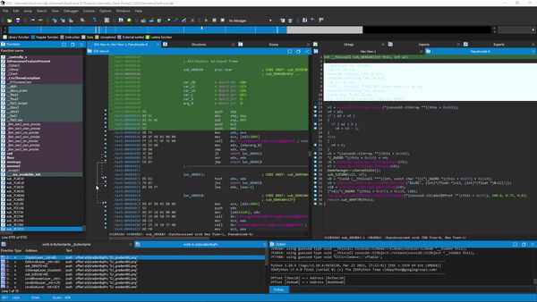

# BromaIDA

Broma IDA support (now real).

Parses a broma file and exports/imports the bindings into the current IDA project.

## Requirements

- IDA 7.0 or higher
- IDAPython Python v3.0.0 support

## Installation

1. Download the release/zip file
2. Copy `BromaIDA.py` and the `broma_ida` folder into `IDA_DIRECTORY/plugins`

## Usage

1. `Ctrl-Shift-B` to start importing/exporting
2. Browse and select the broma file (not tested with anything but `GeometryDash.bro`)
3. Let the script handle the rest and enjoy free bindings
